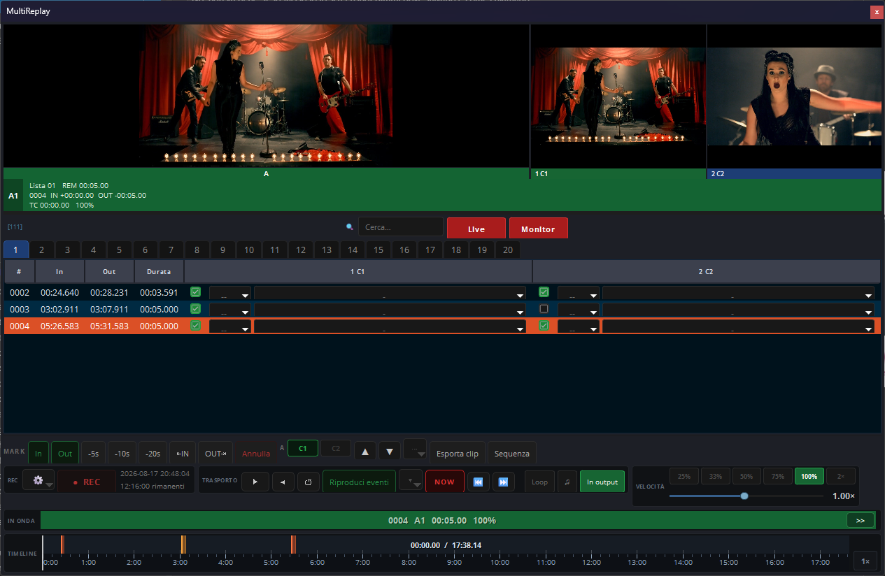

<div align="center">

# OBS MultiReplay

**Multicamera instant replay for OBS Studio, in a native dock.**
**Instant replay multicamera per OBS Studio, in una dock nativa.**

[](https://github.com/angeloruggieridj/obs-multireplay/actions/workflows/push.yaml)
[](https://github.com/angeloruggieridj/obs-multireplay/releases)
[](LICENSE)
[](https://obsproject.com/)
[](#installation)
[](https://github.com/angeloruggieridj/obs-multireplay/releases)

[English](#english) · [Italiano](#italiano)



</div>

> [!WARNING]
> **This is a beta. Do not put it in a critical gallery.**
> The software is still unstable and its behaviour can change between builds:
> it is not recommended for live productions, broadcasts or any job where a
> failure cannot be absorbed. Try it on a rehearsal, a test run, or a rig you
> can afford to restart.
>
> **Want to help test it?** Download it, use it, and when something goes wrong
> [open an issue](https://github.com/angeloruggieridj/obs-multireplay/issues/new)
> describing what you did and what happened — and **attach the OBS log of that
> run**. The log is what makes a report actionable; without it almost nothing
> can be diagnosed. Find it in **Help ▸ Log Files ▸ Show Log Files**, or at
> `%APPDATA%\obs-studio\logs` (Windows),
> `~/Library/Application Support/obs-studio/logs` (macOS),
> `~/.config/obs-studio/logs` (Linux).

> [!WARNING]
> **Questa è una beta. Non metterla in una regia critica.**
> Il software è ancora instabile e il suo comportamento può cambiare da una
> build all'altra: è sconsigliato in produzioni dal vivo, dirette o qualunque
> lavoro in cui non ti puoi permettere un guasto. Provalo su una prova
> generale, su una registrazione di prova o su un impianto che puoi
> permetterti di riavviare.
>
> **Vuoi fare da beta tester?** Scaricalo, usalo e quando qualcosa va storto
> [apri una issue](https://github.com/angeloruggieridj/obs-multireplay/issues/new)
> raccontando cosa hai fatto e cosa è successo — e **allega il log di OBS di
> quell'esecuzione**. È il log a rendere una segnalazione utilizzabile: senza,
> non si diagnostica quasi niente. Lo trovi in **Aiuto ▸ File di log ▸ Mostra i
> file di log**, oppure in `%APPDATA%\obs-studio\logs` (Windows),
> `~/Library/Application Support/obs-studio/logs` (macOS),
> `~/.config/obs-studio/logs` (Linux).

---

## English

Press a key while the action happens, and play it back a second later — from any
camera, at any speed, forwards or backwards, **while the event is still being
recorded**.

Every angle is recorded at the same time on one shared timeline, so a single
mark means the *same frame* on every camera. The whole panel is a native Qt dock
inside OBS: no browser, no web server, no second application to keep on screen.

### How it works, and why that matters

The replay does **not** read the files being written to disk. It reads the
encoded packets coming out of the encoders OBS is *already* running for the
recording, and keeps the last minutes of them in a bounded ring in RAM.

| | |
|---|---|
| **No second encode** | Your machine encodes each camera once, for the recording. The replay costs no extra encoder and writes nothing of its own. |
| **~140 ms to the live edge** | Measured on an Intel iGPU at 1080p30. Tailing a growing file costs roughly a second, because that is how often the muxer flushes a fragment. |
| **Zero skew between angles** | Every packet carries the same system clock, so the alignment between cameras is *read*, not estimated. Cutting between two angles of one action lands on the same frame. |
| **Exact or refused** | A range the engine cannot serve frame-accurately is refused, never rounded to "near enough". Rounding is how a wrong replay that looks plausible reaches air. |

### What it does

#### Recording

* **Up to 8 camera angles at once.** Each gets its own file series; all of them
  share one master timeline, which is what makes a single mark meaningful on
  every camera at once.
* **A pre-flight that refuses impossible takes.** Before REC it checks the free
  space *expressed in minutes of footage at your bitrate*, measures the disk's
  actual write bandwidth against what the take will demand, works out whether
  the replay ring fits in RAM, and confirms the cameras are really there. If
  something cannot work it says so and does not start; if something is merely
  tight it degrades visibly and tells you by how much.
* **Health monitoring during the take.** Packet flow per angle, dropped frames,
  ring occupancy, disk. A dead camera is named within a couple of seconds. It
  reports and nothing else: no rule in it can take anything off air by itself,
  because a gallery that drops out because a disk got slow has turned a
  recoverable problem into a broadcast one.

#### Marking

* **In / Out, and the −5s / −10s / −20s keys.** You always mark *after* seeing
  the action, so the interesting keys are the ones that reach backwards.
* **Pre-roll and post-roll**, applied at the moment of marking rather than at
  playback. The In you read in the list is the In that will play, and it stays
  editable.
* **Trim to the frame** on an event already marked, from the buttons or from a
  hotkey held down while you watch the picture. A mark taken live is late by
  definition; before this the only remedy was deleting it and marking again,
  which loses the angles and the notes.
* **20 event lists**, renameable, with search across ids, tags and angles.
* **One cell per angle, holding all three answers**: does this camera play, at
  what speed, and what is it. No dialog anywhere — live, an edit that
  costs a dialog is an edit that does not get made.
* **Your own tag vocabulary.** A word typed on one event is offered on every
  other one for the rest of the session, and your production's own list — whatever
  you call the moments — imports and exports as plain text, one per line.
* **A running order you control.** A highlights reel does not go out in the
  order the marks were taken; the order is saved with the project.

#### Playback

* **Two replay bays, A and B** (B is optional and off by default). Each one is
  an ordinary OBS input that you place in your own scenes — so transitions, the
  audio mixer and every output work exactly as they already do. Keep one bay on
  air while you prepare the next.
* **Speed 5–200%, applied while the slider moves.** Slow motion here is only
  wider spacing between frames: nothing is re-encoded and the clip does not
  restart, so you can judge the speed by watching the picture instead of aiming
  at it. **The audio is time-stretched and keeps its pitch** — slow motion is
  not silent and not comical.
* **Pause holds the frame**, and pressing play again carries on from there
  rather than from the in-point.
* **Reverse playback** and **single-frame step in both directions**, because
  finding the right frame means passing it and coming back.
* **Watch a stretch nobody marked.** Put the position bar anywhere in the
  recorded timeline and press play: that footage plays, from there, until you
  press stop — no event, no row in the list, nothing added to your running
  order. It plays **off air**, so reviewing an action you did not mark can
  never reach Program by itself. If you decide it should go up, **"Play events"
  is what puts it there** — the key's second function — and it starts from the
  same instant you were watching, not from wherever you stopped. Stop hands
  Program back to the scene it was on.
* **A position bar over the whole recorded timeline** — graduated, zoomable by
  time span ("show me the last five minutes", not "zoom 8×"), with event
  markers you can drag by their edges. Stops between takes are drawn as joins,
  not gaps: every position on the bar is footage that exists.
* **Multiview** of every configured camera, with tally — green for the angle you
  are watching, red for the one on air. Click a tile to select that angle.
* **The angle boxes follow what you are reviewing.** Cue an event, play one, or
  move the position bar, and every box shows **that moment on its own lens** —
  which is what the strip is for: choosing the angle before the replay goes up.
  Press **Live** and they go back to the cameras in real time. A box showing
  the camera as it is *now* while you review something that happened two
  minutes ago is worse than a black rectangle, because it looks like the
  footage you are reviewing.
* **To Program, with your transitions.** Separate in and out transitions
  (stingers included), and between two events either a **cut or a dip through
  black**. Between two *angles* of the same event it stays a cut on purpose: you
  are comparing two lenses on one action, and a dissolve hides exactly the
  frames you are looking at.
* **A music bed** under the replay, from an audio file or from one of your own
  OBS sources.

#### Export

* **One MP4 per event, frame-accurate**, written by stream copy: exact on the
  In, no re-encode, seconds rather than minutes. Per-angle speeds are honoured,
  so an angle you marked at 50% exports at 50%.
* **A highlights reel in a single file** — your events, in your order, on your
  angles, with your music over them. Also stream-copied.
* **YouTube chapters**, to the clipboard and to a file in the project folder.

#### Control surface

* **A hotkey for every command**, registered with OBS itself — so they appear in
  OBS's Hotkeys settings and a Stream Deck reaches them through OBS's native
  integration, with no extra plugin in between.
* **A keyboard layer on the dock**: arrows step a frame (a second with Shift),
  up/down walk the event list, `+`/`−` change speed, Enter plays. Typing always
  wins — the search box and the tag cells are two pixels away from these
  commands, and typing a tag must not send the panel back a frame.
* **Pull the panel out and give it a whole monitor.** Float the dock and a **⛶**
  key appears next to *Monitors*: one press and the panel fills the screen it is
  on — no dragging four edges into four corners. Press it again, or `Esc`, and it
  comes back to exactly the size it had. Docked inside OBS the key is not there
  at all: there is no window of ours to expand, and a key that does nothing is a
  key your eye has to skip past every time it reads the row.
  A **double-click on its title bar maximises it** — the window grown to the
  screen but keeping its title bar, which is the other half of the pair (Qt's
  own answer to a double-click is to re-dock the panel, which inside OBS can
  drop it behind another dock's tab, and then the panel you were working in has
  simply disappeared). The floating window also gets the **Maximize** box its
  title bar is normally missing. There is deliberately no Minimize: an OBS dock
  is owned by the OBS main window, and Windows gives an owned window no taskbar
  button — so that box would be a one-way door. To dock the panel again, drag
  the window back onto the OBS window, the same gesture that pulled it out.

#### Projects and updates

* **It sets itself up.** On a machine where nothing is configured yet, the panel
  offers one short dialog with the five answers it cannot work without — where
  recordings go, the project name, which OBS sources are the cameras, which
  scene the replay goes on air in, and how Branch Output should record. Offered,
  not forced, and always back on the ⚙ menu under *Guided setup*.
* **It can install Branch Output for you.** MultiReplay records through that
  plugin and refuses at REC without it, so when it is missing the panel says so
  on every launch instead of writing it to a log. It will fetch the right file
  for your platform — the signed installer on Windows, the `.pkg` on macOS, the
  `.deb` on Linux — check it against the checksum GitHub publishes for it, and
  hand it to your system's installer. A file whose checksum does not match, or
  that publishes none, is refused rather than run.
* **Settings belong to the project.** A new project starts from a copy of what
  is configured now and then goes its own way, so a two-camera match cannot
  inherit the three-camera rig of the one before it. A project already on disk
  adopts the current settings the first time it is opened — none ever opens
  blank. Only the session folder, which project is open and the update channel
  belong to the installation.
* **In-app updates** (⚙ ▸ Settings ▸ Updates). Checks the published releases,
  shows what changed, downloads and installs. **Stable** or **beta** channel.
  The plugin is never replaced under a running OBS: the install waits until you
  close it, then starts it again.

  Every download is **checked against the SHA-256 the release publishes** before
  anything is staged, and a release that publishes no checksum for its own file
  is refused rather than installed. Only the archive built for *your* platform
  is offered; where there is no installer (macOS, Linux) the panel says so
  instead of pretending, and hands you the file to unpack yourself.

### Requirements

| | |
|---|---|
| OBS Studio | **32 or newer** |
| Branch Output | **[Download](https://github.com/OPENSPHERE-Inc/branch-output/releases)** · [repository](https://github.com/OPENSPHERE-Inc/branch-output) — this is the recording layer, and MultiReplay does nothing without it |
| Platforms | Windows (primary) · macOS · Linux (X11/XWayland; under native Wayland the embedded previews say so in the box rather than going black) |

### Installation

1. Install **Branch Output** first — download it from its official repository,
   [github.com/OPENSPHERE-Inc/branch-output/releases](https://github.com/OPENSPHERE-Inc/branch-output/releases)
   — and set its `Interlock` to `Always ON`. Without that it will not start
   recording, and MultiReplay will tell you so rather than let you mark events
   over footage that does not exist.
2. Download the package for your platform from the
   [releases page](https://github.com/angeloruggieridj/obs-multireplay/releases)
   and install it.
3. Restart OBS. The dock appears under **Docks ▸ MultiReplay**.
4. Open **⚙ ▸ Settings ▸ Cameras** and point each slot at one of your sources.
5. Add **MultiReplay - Replay A** to a scene of yours — it is an ordinary OBS
   input, and it has to be in a scene to be seen and heard.

On Windows, OBS only scans `%ProgramData%\obs-studio\plugins`; the installer
puts the plugin there.

### Building from source

```sh
git clone https://github.com/angeloruggieridj/obs-multireplay
cd obs-multireplay
cmake --preset windows-x64          # or macos / ubuntu-x86_64
cmake --build --preset windows-x64 --config RelWithDebInfo
```

The dependency versions are pinned in `buildspec.json` and **must match the OBS
version** you build against; if they do not, the module fails to load with a
bare "module not found" and nothing else.

### Known issue: the OBS interface turns black (Windows 11 24H2/25H2)

**This is a Windows bug, not a plugin bug**, and it happens to OBS on its own:
it is reported by people who do not have this plugin installed, on both Intel
and NVIDIA graphics. It is worth knowing about because it looks alarming, and
the instinctive reaction — killing OBS — is the wrong one.

**What you see:** everything Qt draws goes black — buttons, tables, borders —
while the preview tiles keep showing pictures. On a second monitor the mouse
pointer appears **twice**: the real one, and the one left frozen inside the last
image that reached the dead screen. OBS is **not hung**: it is alive, still
drawing and still answering — which is why closing it from the taskbar shuts it
down cleanly.

**What to do, in this order:**

1. **`Win+Down` then `Win+Up`.** Minimising and restoring the window makes it
   re-render. Always try this first: it touches nothing but OBS.
2. `Ctrl+Shift+Win+B` **only if that fails**. It reinitialises the whole
   graphics stack — a second of black on **every** display — so during a live
   show it is worse than the problem it fixes.

**To stop it happening**, on the affected machine only, from an elevated
PowerShell, then reboot:

```powershell
New-ItemProperty -Path 'HKLM:\SOFTWARE\Microsoft\Windows\Dwm' -Name OverlayTestMode -PropertyType DWord -Value 5 -Force
New-ItemProperty -Path 'HKLM:\SOFTWARE\Microsoft\Windows\Dwm' -Name OverlayMinFPS -PropertyType DWord -Value 0 -Force
```

That disables Multi-Plane Overlay, the presentation path the regression lives
in. **Both** values are needed on 24H2 and later. Undo with `Remove-ItemProperty`
on the same two names and another reboot.

Background: [OBS forum thread](https://obsproject.com/forum/threads/obs-ui-turns-black-only-the-preview-and-program-showing.195339/)
· [microsoft/Windows-Dev-Performance#136](https://github.com/microsoft/Windows-Dev-Performance/issues/136).

### Privacy

No telemetry, no analytics, nothing phoned home about your recordings, your
project names or how you use the panel. The only network traffic this plugin
ever makes is to `api.github.com`, and only when you ask for it — checking
for a plugin update (⚙ ▸ Settings ▸ Updates ▸ Check) or fetching Branch
Output when the panel offers to install it for you. Neither happens on
launch, in the background, or on any timer: whether Branch Output is
present is a local check with no network in it at all, and the update page
sits idle until its Check button is pressed. Every download either of those
can lead to is verified against a SHA-256 checksum before anything is
staged, over a plain, unauthenticated HTTPS GET with nothing about your
machine attached beyond what any HTTP client sends.

### Reporting a problem

Beta testers are what this stage is for.
[Open an issue](https://github.com/angeloruggieridj/obs-multireplay/issues/new)
with:

1. **What you were doing** when it went wrong, and what you expected instead.
2. **The OBS log of that run** — attach the file, do not paste an excerpt. The
   plugin logs everything it decides and why, and the line that explains a
   failure is rarely the one next to it. **Help ▸ Log Files ▸ Show Log Files**.
3. **How many cameras**, at what resolution and bitrate, and which encoder.
4. Your **OBS version**, your **Branch Output version** and your OS.

If OBS froze or crashed, say whether a recording was running at the time: it
narrows the search enormously.

For a **layout or sizing problem** (a preview the wrong size, panels that do not
come back after a resize), turn on **⚙ ▸ Settings ▸ Advanced ▸ Verbose log**
first, then reproduce it and attach that run's log: it records the exact
geometry of every pass, so the fault can be read off the log instead of guessed
at.

### Licence

GPL-2.0-or-later. See [LICENSE](LICENSE).

The recording layer is provided by the Branch Output plugin (GPL-2.0). This
project reproduces the layout, arrangement and terminology of established
broadcast replay controllers, so that an operator finds every control where his
hand already goes; it contains none of their code, assets or branding.

---

## Italiano

Premi un tasto mentre l'azione succede e un secondo dopo la rivedi: da qualsiasi
camera, a qualsiasi velocità, avanti o indietro, **mentre l'evento è ancora in
registrazione**.

Tutti gli angoli vengono registrati insieme su un'unica timeline, quindi una
sola marcatura indica lo *stesso fotogramma* su ogni camera. Il pannello è una
dock Qt nativa dentro OBS: niente browser, niente server web, nessuna seconda
applicazione da tenere sullo schermo.

### Come funziona, e perché cambia le cose

Il replay **non** legge i file mentre vengono scritti. Legge i pacchetti già
codificati che escono dagli encoder che OBS sta *già* usando per registrare, e
ne tiene gli ultimi minuti in un buffer circolare in RAM.

| | |
|---|---|
| **Nessuna seconda codifica** | Il computer codifica ogni camera una volta sola, per la registrazione. Il replay non aggiunge encoder e non scrive niente di suo. |
| **~140 ms dall'azione all'immagine** | Misurati su iGPU Intel a 1080p30. Inseguire un file mentre viene scritto costa circa un secondo, perché è quello l'intervallo con cui il muxer scarica un frammento su disco. |
| **Nessuno scarto fra gli angoli** | Ogni pacchetto porta lo stesso orologio di sistema: l'allineamento fra le camere si legge, non si stima. Passare da un angolo all'altro della stessa azione cade sullo stesso fotogramma. |
| **O esatto, o rifiutato** | Un intervallo che il motore non può restituire esatto al fotogramma viene rifiutato, mai arrotondato a "quasi". È l'arrotondamento che manda in onda un replay sbagliato ma credibile. |

### Cosa sa fare

#### Registrazione

* **Fino a 8 angoli camera insieme.** Ognuno ha la sua serie di file, ma tutti
  condividono una sola master timeline: è questo che rende una singola
  marcatura valida su tutte le camere contemporaneamente.
* **Un controllo prima del REC che rifiuta le registrazioni impossibili.**
  Verifica lo spazio libero *espresso in minuti di girato al tuo bitrate*,
  misura sul serio quanto scrive il disco e lo confronta con quello che la
  registrazione gli chiederà, calcola se il buffer di replay entra nella RAM
  disponibile e controlla che le camere ci siano davvero. Se qualcosa non può
  funzionare lo dice e non parte; se è solo al limite riduce quello che deve
  ridurre e ti dice di quanto.
* **Controllo continuo mentre registri.** Pacchetti in arrivo da ogni angolo,
  fotogrammi persi, quanto è pieno il buffer, il disco. Una camera che smette
  di dare segnale viene segnalata per nome in un paio di secondi. Si limita a
  segnalare, ed è una scelta precisa: se una regola potesse fermare la
  registrazione o cambiare inquadratura per conto suo, un disco che rallenta
  per due secondi diventerebbe un buco in diretta. Il controllo dice cosa non
  va; a decidere resta chi sta al banco.

#### Marcatura

* **In / Out e i tasti −5s / −10s / −20s.** Si marca sempre *dopo* aver visto
  l'azione, quindi i tasti che servono davvero sono quelli che tornano indietro.
* **Pre-roll e post-roll**, applicati al momento della marcatura e non in
  riproduzione: l'In che leggi nella lista è quello che partirà, e resta
  modificabile.
* **Correzione al fotogramma** di un evento già marcato, dai pulsanti o tenendo
  premuta una scorciatoia mentre guardi l'immagine. Una marcatura presa in
  diretta è in ritardo per definizione; prima l'unico rimedio era cancellarla e
  rifarla, perdendo angoli e commenti.
* **20 liste di eventi**, rinominabili, con ricerca su id, tag e angoli.
* **Una cella per angolo, con dentro tutte e tre le risposte**: se questa camera
  va riprodotta, a che velocità e con che commento. Nessuna finestra di dialogo,
  da nessuna parte: dal vivo, una modifica che costa una finestra è una modifica
  che non viene fatta.
* **I tuoi tag.** Una parola scritta su un evento viene proposta su tutti gli
  altri per il resto della sessione, e il vocabolario che usi tu — comunque
  chiami i momenti — si importa e si esporta come testo semplice, uno per riga.
* **La scaletta la decidi tu.** Una raccolta di highlights non esce nell'ordine
  in cui hai preso le marcature; l'ordine viene salvato insieme al progetto.

#### Riproduzione

* **Due canali di replay, A e B** (il B è opzionale e di default è spento).
  Ognuno è un normale input di OBS che metti nelle tue scene, quindi
  transizioni, mixer audio e uscite funzionano esattamente come hanno sempre
  fatto. Puoi tenere un canale in onda mentre prepari l'altro.
* **Velocità dal 5 al 200%, applicata mentre trascini il cursore.** Qui lo slow
  motion è solo una spaziatura più larga fra i fotogrammi: non si ricodifica
  niente e la clip non riparte da capo, così la velocità la scegli guardando
  l'immagine invece di indovinarla. **L'audio viene rallentato mantenendo la
  tonalità**: il rallentatore non è muto, e non suona un'ottava sotto.
* **La pausa congela il fotogramma**, e premendo di nuovo play si riparte da lì
  e non dall'inizio della clip.
* **Riproduzione all'indietro** e **avanzamento di un fotogramma nelle due
  direzioni**, perché trovare il fotogramma giusto vuol dire superarlo e
  tornare indietro.
* **Rivedi un tratto che nessuno ha marcato.** Porta la barra di posizione dove
  vuoi sul girato e premi play: quel girato parte da lì e va avanti finché non
  premi stop — nessun evento, nessuna riga in lista, niente che finisca nella
  tua scaletta. Va **fuori onda**, così rivedere un'azione che non hai marcato
  non può arrivare al Program da sé. Se decidi che deve andarci, **è
  "Riproduci eventi" a mandarcela** — è la seconda funzione di quel tasto — e
  riparte dall'istante che stavi guardando, non da dove ti sei fermato. Lo stop
  restituisce il Program alla scena su cui stava.
* **Una barra di posizione su tutto il girato** — graduata, con zoom per
  intervallo di tempo ("fammi vedere gli ultimi cinque minuti", non "zoom 8×") e
  marcatori degli eventi che puoi trascinare per i bordi. Gli stop fra una take
  e l'altra sono disegnati come giunzioni, non come buchi: ogni punto della
  barra corrisponde a girato che esiste davvero.
* **Multiview** di tutte le camere configurate, con tally: verde l'angolo che
  stai guardando, rosso quello in onda. Un clic su un riquadro seleziona quella
  camera.
* **I riquadri degli angoli seguono quello che stai rivedendo.** Metti in cue un
  evento, riproducilo o muovi la barra di posizione, e ogni riquadro mostra
  **quel momento sul proprio obiettivo** — che è il motivo per cui la striscia
  esiste: scegliere l'angolo prima di mandare il replay in onda. Premi **Live**
  e tornano alle camere in tempo reale. Un riquadro che mostra la camera com'è
  *adesso* mentre rivedi qualcosa successo due minuti fa è peggio di un
  rettangolo nero, perché sembra il girato che stai rivedendo.
* **Messa in onda con le tue transizioni.** Transizione di andata e di ritorno
  separate (stinger compresi) e, fra un evento e l'altro, **stacco oppure
  dissolvenza al nero**. Fra due *angoli* dello stesso evento resta uno stacco,
  ed è voluto: stai confrontando due obiettivi sulla stessa azione, e una
  dissolvenza nasconderebbe proprio i fotogrammi che vuoi vedere.
* **Una base musicale** sotto il replay, da un file audio o da una tua sorgente
  di OBS.

#### Esportazione

* **Un MP4 per evento, esatto al fotogramma**, scritto copiando i pacchetti:
  parte precisa sull'In, nessuna ricodifica, secondi invece di minuti. Le
  velocità per angolo vengono rispettate, quindi un angolo marcato al 50% esce
  al 50%.
* **Una raccolta di highlights in un unico file**: i tuoi eventi, nel tuo
  ordine, sugli angoli che hai scelto, con la tua musica sopra. Anche questa
  senza ricodifica.
* **Capitoli per YouTube**, negli appunti e in un file nella cartella del
  progetto.

#### Comandi

* **Una scorciatoia per ogni comando**, registrata dentro OBS: compaiono nelle
  Scorciatoie di OBS e uno Stream Deck le raggiunge attraverso l'integrazione
  nativa di OBS, senza altri plugin di mezzo.
* **La tastiera comanda la dock**: le frecce spostano di un fotogramma (di un
  secondo con Shift), su e giù scorrono la lista, `+` e `−` cambiano velocità,
  Invio riproduce. Mentre stai scrivendo, però, ha la precedenza la scrittura:
  la casella di ricerca e le celle dei tag sono a due pixel da questi comandi, e
  digitare un tag non deve mandare il pannello indietro di un fotogramma.
* **Sgancia il pannello e dagli un monitor intero.** A dock sganciata compare un
  tasto **⛶** accanto a *Monitor*: una pressione e il pannello riempie lo schermo
  su cui si trova, senza trascinare quattro bordi in quattro angoli. Premilo di
  nuovo, o `Esc`, e torna esattamente alla dimensione di prima. Ancorata dentro
  OBS il tasto non c'è proprio: non esiste una finestra nostra da allargare, e un
  tasto che non fa niente è un tasto che l'occhio deve scartare ogni volta che
  legge la riga.
  Il **doppio click sulla barra del titolo la massimizza** — la finestra
  cresciuta a tutto lo schermo ma con la sua barra del titolo, che è l'altra
  metà della coppia (di suo Qt risponde a un doppio click ri-ancorando il
  pannello, che dentro OBS può finire dietro il tab di un altro pannello: e a
  quel punto quello su cui stavi lavorando è semplicemente sparito). La finestra
  sganciata riceve anche l'**Ingrandisci** che normalmente manca dalla sua barra
  del titolo. Il Riduci a icona di proposito non c'è: un pannello di OBS è
  posseduto dalla finestra principale, e a una finestra posseduta Windows non dà
  un pulsante nella barra delle applicazioni — quel tasto sarebbe una porta a
  senso unico. Per ri-ancorare il pannello, trascina la finestra sopra quella di
  OBS: lo stesso gesto con cui l'hai tirata fuori.

#### Progetti e aggiornamenti

* **Si configura da solo.** Su una macchina dove non c'è ancora niente, il
  pannello propone un dialogo corto con le cinque risposte senza cui non può
  funzionare: dove finiscono le registrazioni, il nome del progetto, quali
  sorgenti OBS sono le camere, in quale scena va in onda il replay e come deve
  registrare Branch Output. Proposto, non imposto, e sempre ritrovabile nel menu
  ⚙ alla voce *Configurazione guidata*.
* **Può installare Branch Output al posto tuo.** MultiReplay registra attraverso
  quel plugin e senza rifiuta di partire al REC, quindi quando manca il pannello
  lo dice a ogni avvio invece di scriverlo in un log. Scarica il file giusto per
  la tua piattaforma — l'installer firmato su Windows, il `.pkg` su macOS, il
  `.deb` su Linux — lo confronta con il checksum che GitHub pubblica per quel
  file e lo passa all'installer di sistema. Un file che non combacia, o che non
  pubblica nessun checksum, viene rifiutato invece che eseguito.
* **Le impostazioni appartengono al progetto.** Un progetto nuovo parte da una
  copia di ciò che è configurato adesso e poi va per la sua strada: una partita
  a due camere non può più ereditare il rig a tre di quella prima. Un progetto
  già su disco adotta le impostazioni correnti alla prima apertura, così non se
  ne apre mai uno vuoto. Restano dell'installazione soltanto la cartella di
  sessione, quale progetto è aperto e il canale di aggiornamento.
* **Aggiornamenti dal pannello** (⚙ ▸ Impostazioni ▸ Aggiornamenti). Controlla
  le release pubblicate, mostra che cosa cambia, scarica e installa. Canale
  **stabile** o **beta**. Il plugin non viene mai sostituito sotto un OBS in
  esecuzione: l'installazione aspetta che tu lo chiuda, poi lo riavvia.

  Ogni download viene **verificato contro lo SHA-256 che la release pubblica**
  prima di essere messo da parte, e una release che non pubblica il checksum del
  proprio file viene rifiutata invece che installata. Ti viene offerto soltanto
  l'archivio costruito per la *tua* piattaforma; dove non esiste un installatore
  (macOS, Linux) il pannello lo dice invece di far finta, e ti consegna il file
  da scompattare a mano.

### Requisiti

| | |
|---|---|
| OBS Studio | **32 o successivo** |
| Branch Output | **[Download](https://github.com/OPENSPHERE-Inc/branch-output/releases)** · [repository](https://github.com/OPENSPHERE-Inc/branch-output) — è lo strato che registra, e senza di lui MultiReplay non fa niente |
| Piattaforme | Windows (principale) · macOS · Linux (X11/XWayland; sotto Wayland nativo le anteprime lo scrivono nel riquadro invece di restare nere) |

### Installazione

1. Installa prima **Branch Output** — scaricalo dalla sua repository ufficiale,
   [github.com/OPENSPHERE-Inc/branch-output/releases](https://github.com/OPENSPHERE-Inc/branch-output/releases)
   — e imposta il suo `Interlock` su `Always ON`. Senza, non avvia la
   registrazione: e MultiReplay te lo dice, invece di lasciarti marcare eventi
   su girato che non esiste.
2. Scarica il pacchetto per la tua piattaforma dalla
   [pagina delle release](https://github.com/angeloruggieridj/obs-multireplay/releases)
   e installalo.
3. Riavvia OBS. La dock compare in **Pannelli ▸ MultiReplay**.
4. Apri **⚙ ▸ Impostazioni ▸ Telecamere** e punta ogni slot su una tua sorgente.
5. Aggiungi **MultiReplay - Replay A** a una tua scena: è un normale input di
   OBS, e per vederlo e sentirlo deve stare in una scena.

Su Windows OBS cerca i plugin solo in `%ProgramData%\obs-studio\plugins`, ed è
lì che li mette l'installer.

### Compilare dai sorgenti

```sh
git clone https://github.com/angeloruggieridj/obs-multireplay
cd obs-multireplay
cmake --preset windows-x64          # oppure macos / ubuntu-x86_64
cmake --build --preset windows-x64 --config RelWithDebInfo
```

Le versioni delle dipendenze sono fissate in `buildspec.json` e **devono
corrispondere alla versione di OBS** con cui compili; se non corrispondono il
modulo non si carica e l'unico messaggio che ottieni è "module not found".

### Problema noto: l'interfaccia di OBS diventa nera (Windows 11 24H2/25H2)

**È un difetto di Windows, non del plugin**, e capita a OBS da solo: lo
segnalano persone che questo plugin non ce l'hanno installato, sia su grafica
Intel sia su NVIDIA. Vale la pena conoscerlo perché fa impressione, e la
reazione istintiva — chiudere OBS — è quella sbagliata.

**Cosa vedi:** tutto ciò che disegna Qt diventa nero — tasti, tabelle, bordi —
mentre i riquadri di anteprima continuano a mostrare le immagini. Su un secondo
monitor il puntatore del mouse si vede **due volte**: quello vero, e quello
rimasto impresso nell'ultima immagine arrivata allo schermo morto. OBS **non è
bloccato**: è vivo, sta ancora disegnando e risponde ancora — infatti se lo
chiudi dalla barra delle applicazioni si chiude in modo pulito.

**Cosa fare, in quest'ordine:**

1. **`Win+Giù` poi `Win+Su`.** Minimizzare e ripristinare la finestra la fa
   ridisegnare. Prova sempre prima questo: tocca solo OBS.
2. `Ctrl+Shift+Win+B` **solo se il primo non basta**. Reinizializza tutto lo
   stack grafico — un secondo di nero su **ogni** schermo — quindi durante una
   diretta è peggio del problema che risolve.

**Per non farlo più capitare**, solo sulla macchina colpita, da PowerShell
**come amministratore**, poi riavvia:

```powershell
New-ItemProperty -Path 'HKLM:\SOFTWARE\Microsoft\Windows\Dwm' -Name OverlayTestMode -PropertyType DWord -Value 5 -Force
New-ItemProperty -Path 'HKLM:\SOFTWARE\Microsoft\Windows\Dwm' -Name OverlayMinFPS -PropertyType DWord -Value 0 -Force
```

Disattiva il Multi-Plane Overlay, il percorso di presentazione in cui vive la
regressione. Su 24H2 e successivi servono **entrambi** i valori. Si annulla con
`Remove-ItemProperty` sugli stessi due nomi e un altro riavvio.

Riferimenti: [thread sul forum OBS](https://obsproject.com/forum/threads/obs-ui-turns-black-only-the-preview-and-program-showing.195339/)
· [microsoft/Windows-Dev-Performance#136](https://github.com/microsoft/Windows-Dev-Performance/issues/136).

### Privacy

Nessuna telemetria, nessuna analytics, niente che venga comunicato a
qualcuno sulle tue registrazioni, i nomi dei progetti o come usi il
pannello. L'unico traffico di rete che questo plugin genera va verso
`api.github.com`, e solo quando lo chiedi tu — controllare gli
aggiornamenti (⚙ ▸ Impostazioni ▸ Aggiornamenti ▸ Controlla) o scaricare
Branch Output quando il pannello si offre di installarlo. Nessuno dei due
parte all'avvio, in background o su un timer: sapere se Branch Output c'è è
un controllo locale, senza rete dentro; la pagina degli aggiornamenti resta
ferma finché non si preme Controlla. Ogni download a cui questi due portano
viene verificato con lo SHA-256 prima di essere messo in staging, su una
richiesta HTTPS semplice e non autenticata, senza nulla della tua macchina
allegato oltre a quello che manda qualunque client HTTP.

### Segnalare un problema

I beta tester sono esattamente il senso di questa fase.
[Apri una issue](https://github.com/angeloruggieridj/obs-multireplay/issues/new)
con:

1. **Cosa stavi facendo** quando è andato storto, e cosa ti aspettavi invece.
2. **Il log di OBS di quell'esecuzione** — allega il file, non incollarne un
   pezzo. Il plugin scrive nel log ogni decisione che prende e il perché, e la
   riga che spiega un guasto quasi mai è quella lì accanto.
   **Aiuto ▸ File di log ▸ Mostra i file di log**.
3. **Quante camere**, a che risoluzione e bitrate, e con che encoder.
4. La tua **versione di OBS**, quella di **Branch Output** e il sistema
   operativo.

Se OBS si è bloccato o è andato in crash, scrivi se in quel momento era in
corso una registrazione: restringe moltissimo il campo.

Per un **problema di disposizione o dimensioni** (un'anteprima della misura
sbagliata, pannelli che non tornano dopo un ridimensionamento), attiva prima
**⚙ ▸ Impostazioni ▸ Avanzate ▸ Log verboso**, poi riproducilo e allega il log
di quell'esecuzione: registra la geometria esatta di ogni passata, così il
guasto si legge dal log invece di doverlo indovinare.

### Licenza

GPL-2.0-or-later. Vedi [LICENSE](LICENSE).

Lo strato di registrazione è fornito dal plugin Branch Output (GPL-2.0). Questo
progetto riprende disposizione, organizzazione e terminologia dei controller di
replay professionali affermati, così che chi li ha usati trovi ogni comando dove
la mano va già da sola; non contiene nulla del loro codice, dei loro asset o del
loro marchio.
