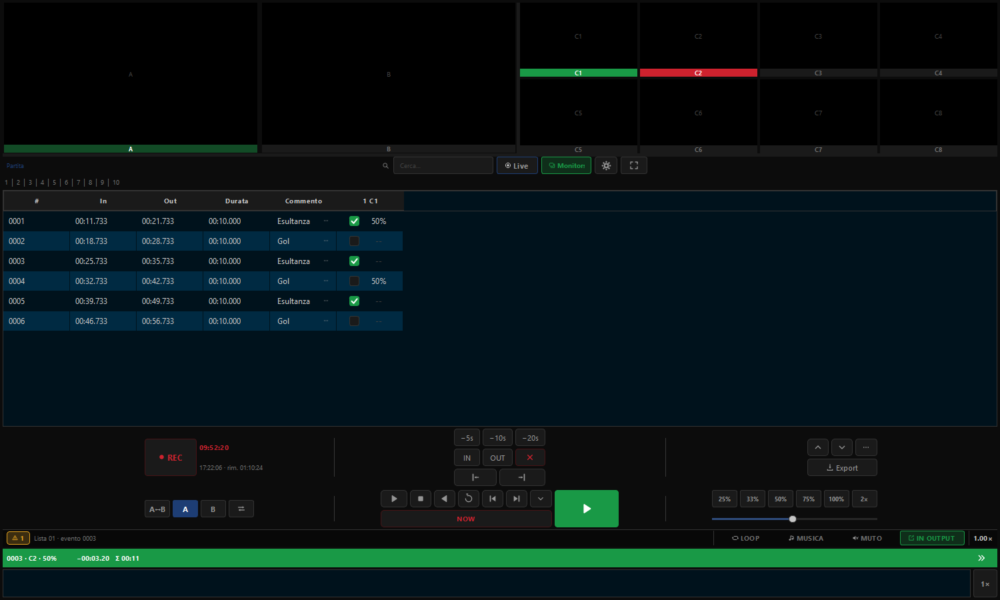
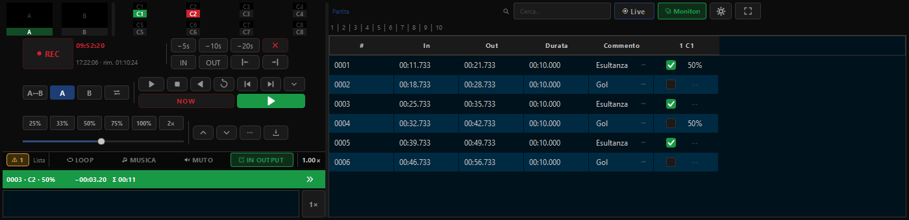
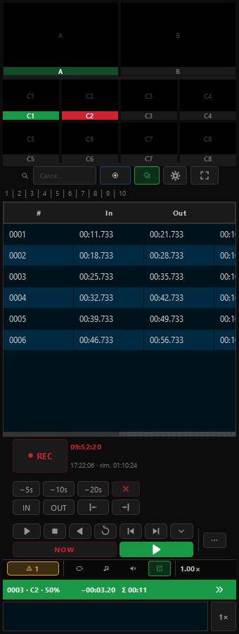

<div align="center">

# 🎥 OBS MultiReplay

**Multicamera instant replay for OBS Studio, in a native dock.**
**Instant replay multicamera per OBS Studio, in una dock nativa.**

[](https://github.com/angeloruggieridj/obs-multireplay/actions/workflows/push.yaml)
[](https://github.com/angeloruggieridj/obs-multireplay/releases)
[](https://github.com/angeloruggieridj/obs-multireplay/releases)
[](LICENSE)


[](docs/verification.md)

[English](#english) · [Italiano](#italiano)


The panel adapts to the room it is given — three arrangements, one codebase (`tools/dock-mockup`):

| Wide (docked full-width / floating) | Short (docked under OBS's preview) | Tall (docked to a side) |
| :---: | :---: | :---: |
|  |  |  |

</div>

> [!WARNING]
> **This is a beta — do not put it in a critical gallery.** Behaviour can change
> between builds. Try it on a rehearsal or a rig you can afford to restart. Hit a
> problem? [Open an issue](https://github.com/angeloruggieridj/obs-multireplay/issues/new)
> and **attach the OBS log** (Help ▸ Log Files ▸ Show Log Files) — without it
> almost nothing can be diagnosed.

> [!WARNING]
> **Questa è una beta — non metterla in una regia critica.** Il comportamento può
> cambiare da una build all'altra. Provala su una prova generale o su un impianto
> che puoi permetterti di riavviare. Problemi?
> [Apri una issue](https://github.com/angeloruggieridj/obs-multireplay/issues/new)
> e **allega il log di OBS** (Aiuto ▸ File di log ▸ Mostra i file di log) — senza,
> non si diagnostica quasi niente.

---

## English

Press a key while the action happens and play it back a second later — any
camera, any speed, forwards or backwards, **while the event is still recording**.
Every angle shares one timeline, so a single mark is the *same frame* on every
camera. Native Qt dock inside OBS: no browser, no web server, no second app.

### Contents

- [Features](#features)
- [How it works](#how-it-works)
- [Requirements](#requirements)
- [Installation](#installation)
- [Unsigned builds](#unsigned-builds)
- [Known issue: OBS turns black (Windows 11 24H2/25H2)](#known-issue-obs-turns-black-windows-11-24h225h2)
- [Building from source](#building-from-source)
- [Privacy](#privacy)
- [Reporting a problem](#reporting-a-problem)
- [Licence](#licence)

### Features

**Recording**

- 🎥 **Up to 8 angles at once** on one shared master timeline — one mark, every camera.
- ✅ **Pre-flight before REC**: free space *in minutes of footage*, measured disk bandwidth, ring-fits-in-RAM, cameras present. Refuses what can't work; degrades visibly what's only tight.
- 🩺 **Live health**: packet flow per angle, dropped frames, ring, disk. Names a dead camera in seconds. Reports only — nothing takes itself off air.

**Marking**

- ⏮️ **In / Out and −5s / −10s / −20s** — the keys reach backwards, because you mark *after* seeing it.
- ✂️ **Pre/post-roll** at mark time, and **trim to the frame** on an event already marked (buttons or a held hotkey).
- 🗂️ **20 event lists**, renameable, searchable across ids, tags and angles.
- 🔢 **One cell per angle** — plays?, speed, note — no dialogs anywhere.
- 🏷️ **Your own tag vocabulary**: a word typed once is offered on every other event; imports/exports as plain text.
- ↕️ **A running order you control**, saved with the project.

**Playback**

- 🅰️🅱️ **Two replay bays** (B optional, off by default) — each an ordinary OBS input in your scenes; keep one on air while you prep the other.
- ⏩ **Speed 5–200%**, applied while the slider moves — no re-encode, no restart. Slow-mo audio is time-stretched and keeps its pitch.
- ⏸️ **Pause holds the frame**; play resumes from there, not the in-point.
- ◀️ **Reverse playback** and **single-frame step both ways**.
- 🔍 **Review a stretch nobody marked**: drop the bar anywhere, press play — it plays **off air**; "Play events" is what sends it to Program, from the same instant.
- 📏 **Position bar over the whole recorded timeline** — graduated, zoom by time span, draggable event markers; stops between takes are drawn as joins, not gaps.
- 🔳 **Multiview** of every configured camera, with tally (green = watching, red = on air). Click a tile to pick that angle.
- 👁️ **Angle boxes follow the review** — each shows that moment on its own lens; **Live** snaps them back to real time.
- 🎞️ **To Program with your transitions** — separate in/out (stingers included), cut or dip-to-black between events, always a cut between angles.
- 🎵 **A music bed** from an audio file or one of your OBS sources.

**Export**

- 🎬 **One MP4 per event**, frame-accurate, by stream copy — exact on the In, per-angle speeds honoured.
- 📼 **A highlights reel in a single file** — your events, order, angles and music. Also stream-copied.
- 📝 **YouTube chapters**, to the clipboard and to a file in the project folder.

**Control surface**

- ⌨️ **A hotkey for every command**, registered with OBS itself — visible in OBS's Hotkeys settings, reachable from a Stream Deck with no extra plugin in between.
- 🖱️ **A keyboard layer on the dock**: arrows step a frame (a second with Shift), up/down walk the list, `+` / `−` change speed, Enter plays. Typing always wins.
- ⛶ **Float the panel onto a whole monitor** — one key fills the screen, `Esc` brings it back; double-click the title bar to maximise. Maximize box added; no Minimize (an OBS dock is owned by the main window, which gets no taskbar button).

**Projects & updates**

- 🧭 **It sets itself up** — on a fresh machine, one short dialog with the five answers it can't work without. Offered, not forced; always back on the ⚙ menu.
- 📦 **It can install Branch Output for you** — fetches the right file per platform, checks it against GitHub's checksum, hands it to your system installer. A mismatch is refused, not run.
- 🗄️ **Settings belong to the project** — a new project copies the current rig then goes its own way; one already on disk adopts current settings on first open. Only the session folder, the open project and the update channel are global.
- 🔄 **In-app updates** (⚙ ▸ Settings ▸ Updates), **stable** or **beta** — every download SHA-256 verified before staging; the plugin is replaced only after you close OBS, then restarted.

### How it works

The replay does **not** read the files being written to disk. It taps the encoded
packets coming out of the encoders OBS is *already* running for the recording,
and keeps the last minutes of them in a bounded ring in RAM.

| | |
|---|---|
| **No second encode** | Each camera is encoded once, for the recording. The replay costs no extra encoder and writes nothing of its own. |
| **~140 ms to the live edge** | Measured on an Intel iGPU at 1080p30. Tailing a growing file costs roughly a second — the muxer's fragment-flush interval. |
| **Zero skew between angles** | Every packet carries the same system clock, so the alignment between cameras is *read*, not estimated. |
| **Exact or refused** | A range the engine can't serve frame-accurately is refused, never rounded to "near enough". Rounding is how a plausible-looking wrong replay reaches air. |

### Requirements

| | |
|---|---|
| **OBS Studio** | 32 or newer |
| **Branch Output** | [Download](https://github.com/OPENSPHERE-Inc/branch-output/releases) · [repository](https://github.com/OPENSPHERE-Inc/branch-output) — the recording layer; MultiReplay does nothing without it |
| **Platforms** | Windows (primary) · macOS · Linux (X11/XWayland; under native Wayland the embedded previews say so in the box rather than going black) |

### Installation

> [!IMPORTANT]
> The builds are **not code-signed**, so your OS may warn about them or block
> them the first time — on **macOS** you have to clear the download quarantine by
> hand or OBS will silently refuse to load the plugin. See
> [Unsigned builds](#unsigned-builds).

1. **Install Branch Output first** — from its
   [official repository](https://github.com/OPENSPHERE-Inc/branch-output/releases)
   — and set its `Interlock` to `Always ON`, or it never starts recording.
2. **Download** the package for your platform from the
   [releases page](https://github.com/angeloruggieridj/obs-multireplay/releases)
   and install it.
3. **Restart OBS.** The dock appears under **Docks ▸ MultiReplay**.
4. **⚙ ▸ Settings ▸ Cameras** — point each slot at one of your sources.
5. **Add `MultiReplay - Replay A` to a scene** — it is an ordinary OBS input and
   has to be in a scene to be seen and heard.

Windows: OBS only scans `%ProgramData%\obs-studio\plugins`; the installer puts it
there. macOS: the `.pkg` is not notarised — if the dock does not appear, run
`xattr -dr com.apple.quarantine "/Library/Application Support/obs-studio/plugins/obs-multireplay.plugin"`
and restart OBS.

### Unsigned builds

The releases carry **no publisher signature on any platform** — code-signing
certificates are neither free nor issued to one-person projects. Your OS will say
so: macOS quarantines the plugin (and OBS then fails to load it, silently),
Windows marks the zip as coming from the internet.

Unsigned does not mean unverifiable. Every release is built in public from the
tagged source and ships a signed **build provenance attestation**, GitHub's
per-asset **SHA-256 digests** (which the in-app updater checks for you before it
installs anything), and, when a key is configured, **VirusTotal** reports.

👉 **[How to verify a download](docs/verification.md)** — what to expect per
platform, and the three checks, with commands.

### Known issue: OBS turns black (Windows 11 24H2/25H2)

**A Windows bug, not a plugin bug** — reported by people without this plugin, on
both Intel and NVIDIA. It looks alarming, and the instinctive fix (killing OBS)
is the wrong one.

**What you see:** everything Qt draws goes black — buttons, tables, borders —
while the preview tiles keep updating. The mouse pointer may appear twice on a
second monitor. OBS is **not hung**: it is still drawing and answering.

**What to do, in order:**

1. **`Win+Down` then `Win+Up`** — minimise and restore the window. Touches only OBS.
2. **`Ctrl+Shift+Win+B`** only if that fails — it reinitialises the whole
   graphics stack (a second of black on *every* display), so mid-show it is worse
   than the problem.

**To stop it recurring**, on the affected machine only, from an elevated
PowerShell, then reboot:

```powershell
New-ItemProperty -Path 'HKLM:\SOFTWARE\Microsoft\Windows\Dwm' -Name OverlayTestMode -PropertyType DWord -Value 5 -Force
New-ItemProperty -Path 'HKLM:\SOFTWARE\Microsoft\Windows\Dwm' -Name OverlayMinFPS -PropertyType DWord -Value 0 -Force
```

That disables Multi-Plane Overlay, the presentation path the regression lives in.
**Both** values are needed on 24H2+. Undo with `Remove-ItemProperty` on the same
names and another reboot.

Background: [OBS forum thread](https://obsproject.com/forum/threads/obs-ui-turns-black-only-the-preview-and-program-showing.195339/)
· [microsoft/Windows-Dev-Performance#136](https://github.com/microsoft/Windows-Dev-Performance/issues/136).

### Building from source

```sh
git clone https://github.com/angeloruggieridj/obs-multireplay
cd obs-multireplay
cmake --preset windows-x64          # or macos / ubuntu-x86_64
cmake --build --preset windows-x64 --config RelWithDebInfo
```

Dependency versions are pinned in `buildspec.json` and **must match the OBS
version** you build against, or the module fails to load with a bare "module not
found".

### Privacy

No telemetry, no analytics, nothing phoned home. The only network traffic is to
`api.github.com`, and only when **you** ask for it — an update check
(⚙ ▸ Settings ▸ Updates ▸ Check) or fetching Branch Output when the panel offers
to install it. Never on launch, in the background or on a timer. Every download
either can lead to is SHA-256 verified before staging, over a plain
unauthenticated HTTPS GET with nothing about your machine attached.

### Reporting a problem

[Open an issue](https://github.com/angeloruggieridj/obs-multireplay/issues/new) with:

1. **What you were doing** when it went wrong, and what you expected.
2. **The OBS log of that run** — attach the file, don't paste an excerpt
   (Help ▸ Log Files ▸ Show Log Files).
3. **How many cameras**, at what resolution and bitrate, and which encoder.
4. Your **OBS version**, **Branch Output version** and OS.

If OBS froze or crashed, say whether a recording was running — it narrows the
search enormously. For a **layout or sizing problem**, turn on
**⚙ ▸ Settings ▸ Advanced ▸ Verbose log** first, then reproduce and attach that
run's log.

### Licence

GPL-2.0-or-later — see [LICENSE](LICENSE).

The recording layer is the Branch Output plugin (GPL-2.0). This project
reproduces the layout, arrangement and terminology of established broadcast
replay controllers so an operator finds every control where his hand already
goes; it contains none of their code, assets or branding.

---

## Italiano

Premi un tasto mentre l'azione succede e un secondo dopo la rivedi: da qualsiasi
camera, a qualsiasi velocità, avanti o indietro, **mentre l'evento è ancora in
registrazione**. Tutti gli angoli condividono una sola timeline, quindi una
marcatura indica lo *stesso fotogramma* su ogni camera. Dock Qt nativa dentro
OBS: niente browser, niente server web, nessuna seconda applicazione.

### Indice

- [Funzioni](#funzioni)
- [Come funziona](#come-funziona)
- [Requisiti](#requisiti)
- [Installazione](#installazione)
- [Build non firmate](#build-non-firmate)
- [Problema noto: OBS diventa nero (Windows 11 24H2/25H2)](#problema-noto-obs-diventa-nero-windows-11-24h225h2)
- [Compilare dai sorgenti](#compilare-dai-sorgenti)
- [Privacy](#privacy-1)
- [Segnalare un problema](#segnalare-un-problema)
- [Licenza](#licenza)

### Funzioni

**Registrazione**

- 🎥 **Fino a 8 angoli insieme** su una sola master timeline — una marcatura, tutte le camere.
- ✅ **Controllo prima del REC**: spazio libero *in minuti di girato*, banda del disco misurata, buffer che entra in RAM, camere presenti. Rifiuta ciò che non può funzionare; riduce in modo visibile ciò che è solo al limite.
- 🩺 **Controllo continuo**: pacchetti per angolo, fotogrammi persi, buffer, disco. Nomina una camera morta in pochi secondi. Solo segnala — niente si toglie dall'onda da solo.

**Marcatura**

- ⏮️ **In / Out e i tasti −5s / −10s / −20s** — quelli che tornano indietro, perché si marca *dopo* aver visto l'azione.
- ✂️ **Pre/post-roll** al momento della marcatura, e **correzione al fotogramma** di un evento già marcato (pulsanti o scorciatoia tenuta premuta).
- 🗂️ **20 liste di eventi**, rinominabili, con ricerca su id, tag e angoli.
- 🔢 **Una cella per angolo** — si riproduce?, a che velocità, con che commento — nessuna finestra di dialogo.
- 🏷️ **Il tuo vocabolario di tag**: una parola scritta una volta viene proposta su ogni altro evento; si importa/esporta come testo semplice.
- ↕️ **Una scaletta che decidi tu**, salvata col progetto.

**Riproduzione**

- 🅰️🅱️ **Due canali di replay** (il B opzionale, di default spento) — ognuno un normale input di OBS nelle tue scene; tieni un canale in onda mentre prepari l'altro.
- ⏩ **Velocità 5–200%**, applicata mentre trascini il cursore — nessuna ricodifica, nessun riavvio. L'audio del rallentatore è time-stretch e mantiene la tonalità.
- ⏸️ **La pausa congela il fotogramma**; premendo play si riparte da lì, non dall'In.
- ◀️ **Riproduzione all'indietro** e **avanzamento di un fotogramma nelle due direzioni**.
- 🔍 **Rivedi un tratto che nessuno ha marcato**: porta la barra dove vuoi e premi play — va **fuori onda**; è "Riproduci eventi" a mandarlo al Program, dallo stesso istante.
- 📏 **Barra di posizione su tutto il girato** — graduata, zoom per intervallo di tempo, marcatori trascinabili per i bordi; gli stop fra le take sono giunzioni, non buchi.
- 🔳 **Multiview** di tutte le camere configurate, con tally (verde = che guardi, rosso = in onda). Un clic su un riquadro sceglie quell'angolo.
- 👁️ **I riquadri seguono la review** — ognuno mostra quel momento sul proprio obiettivo; **Live** li riporta al tempo reale.
- 🎞️ **In onda con le tue transizioni** — andata e ritorno separate (stinger inclusi), stacco o dissolvenza al nero fra eventi, sempre uno stacco fra angoli.
- 🎵 **Una base musicale** da un file audio o da una tua sorgente OBS.

**Esportazione**

- 🎬 **Un MP4 per evento**, esatto al fotogramma, copiando i pacchetti — preciso sull'In, velocità per angolo rispettate.
- 📼 **Una raccolta di highlights in un unico file** — i tuoi eventi, nel tuo ordine, sugli angoli scelti, con la tua musica. Anche questa senza ricodifica.
- 📝 **Capitoli per YouTube**, negli appunti e in un file nella cartella del progetto.

**Comandi**

- ⌨️ **Una scorciatoia per ogni comando**, registrata dentro OBS — compaiono nelle Scorciatoie di OBS e uno Stream Deck le raggiunge senza altri plugin di mezzo.
- 🖱️ **Uno strato tastiera sulla dock**: le frecce spostano di un fotogramma (di un secondo con Shift), su/giù scorrono la lista, `+` / `−` cambiano velocità, Invio riproduce. Mentre scrivi ha la precedenza la scrittura.
- ⛶ **Sgancia il pannello su un monitor intero** — un tasto riempie lo schermo, `Esc` lo riporta; doppio click sulla barra del titolo per massimizzare. C'è l'Ingrandisci; niente Riduci a icona (un pannello OBS è posseduto dalla finestra principale, che non ha un pulsante nella barra delle applicazioni).

**Progetti e aggiornamenti**

- 🧭 **Si configura da solo** — su una macchina nuova, un dialogo corto con le cinque risposte senza cui non può funzionare. Proposto, non imposto; sempre nel menu ⚙.
- 📦 **Può installare Branch Output al posto tuo** — scarica il file giusto per la piattaforma, lo confronta col checksum di GitHub, lo passa all'installer di sistema. Se non combacia, viene rifiutato.
- 🗄️ **Le impostazioni appartengono al progetto** — un progetto nuovo copia il rig corrente e poi va per la sua strada; uno già su disco adotta le impostazioni correnti alla prima apertura. Restano globali solo la cartella di sessione, il progetto aperto e il canale di aggiornamento.
- 🔄 **Aggiornamenti dal pannello** (⚙ ▸ Impostazioni ▸ Aggiornamenti), **stabile** o **beta** — ogni download verificato con SHA-256 prima dello staging; il plugin viene sostituito solo dopo che chiudi OBS, poi riavviato.

### Come funziona

Il replay **non** legge i file mentre vengono scritti. Legge i pacchetti già
codificati che escono dagli encoder che OBS sta *già* usando per registrare, e ne
tiene gli ultimi minuti in un buffer circolare in RAM.

| | |
|---|---|
| **Nessuna seconda codifica** | Ogni camera è codificata una volta sola, per la registrazione. Il replay non aggiunge encoder e non scrive niente di suo. |
| **~140 ms dall'azione all'immagine** | Misurati su iGPU Intel a 1080p30. Inseguire un file mentre viene scritto costa circa un secondo — l'intervallo con cui il muxer scarica un frammento. |
| **Nessuno scarto fra gli angoli** | Ogni pacchetto porta lo stesso orologio di sistema: l'allineamento fra le camere si legge, non si stima. |
| **O esatto, o rifiutato** | Un intervallo che il motore non può restituire esatto al fotogramma viene rifiutato, mai arrotondato. È l'arrotondamento che manda in onda un replay sbagliato ma credibile. |

### Requisiti

| | |
|---|---|
| **OBS Studio** | 32 o successivo |
| **Branch Output** | [Download](https://github.com/OPENSPHERE-Inc/branch-output/releases) · [repository](https://github.com/OPENSPHERE-Inc/branch-output) — è lo strato che registra, e senza di lui MultiReplay non fa niente |
| **Piattaforme** | Windows (principale) · macOS · Linux (X11/XWayland; sotto Wayland nativo le anteprime lo scrivono nel riquadro invece di restare nere) |

### Installazione

> [!IMPORTANT]
> Le build **non sono firmate**, quindi il sistema operativo può avvisarti o
> bloccarle al primo avvio — su **macOS** devi togliere a mano la quarantena del
> download, altrimenti OBS si rifiuta di caricare il plugin senza dire niente.
> Vedi [Build non firmate](#build-non-firmate).

1. **Installa prima Branch Output** — dalla sua
   [repository ufficiale](https://github.com/OPENSPHERE-Inc/branch-output/releases)
   — e imposta il suo `Interlock` su `Always ON`, o non avvia mai la registrazione.
2. **Scarica** il pacchetto per la tua piattaforma dalla
   [pagina delle release](https://github.com/angeloruggieridj/obs-multireplay/releases)
   e installalo.
3. **Riavvia OBS.** La dock compare in **Pannelli ▸ MultiReplay**.
4. **⚙ ▸ Impostazioni ▸ Telecamere** — punta ogni slot su una tua sorgente.
5. **Aggiungi `MultiReplay - Replay A` a una scena** — è un normale input di OBS
   e per vederlo e sentirlo deve stare in una scena.

Windows: OBS cerca i plugin solo in `%ProgramData%\obs-studio\plugins`, ed è lì
che li mette l'installer. macOS: il `.pkg` non è notarizzato — se la dock non
compare, esegui
`xattr -dr com.apple.quarantine "/Library/Application Support/obs-studio/plugins/obs-multireplay.plugin"`
e riavvia OBS.

### Build non firmate

Le release non portano **nessuna firma dell'editore, su nessuna piattaforma** —
i certificati di code-signing non sono gratuiti né vengono rilasciati a progetti
di una persona sola. Il sistema operativo lo segnala: macOS mette il plugin in
quarantena (e OBS non lo carica, in silenzio), Windows marca lo zip come
proveniente da internet.

Non firmato non vuol dire non verificabile. Ogni release è compilata in pubblico
dai sorgenti taggati e porta con sé un'**attestazione di provenance firmata**,
gli **SHA-256 per asset** di GitHub (che l'updater integrato verifica per te
prima di installare qualsiasi cosa) e, quando è configurata una chiave, i report
**VirusTotal**.

👉 **[Come verificare un download](docs/verification.md)** — cosa aspettarsi su
ogni piattaforma, e le tre verifiche, con i comandi.

### Problema noto: OBS diventa nero (Windows 11 24H2/25H2)

**È un difetto di Windows, non del plugin** — lo segnalano persone che questo
plugin non ce l'hanno, sia su grafica Intel sia NVIDIA. Fa impressione, e la
reazione istintiva (chiudere OBS) è quella sbagliata.

**Cosa vedi:** tutto ciò che disegna Qt diventa nero — tasti, tabelle, bordi —
mentre i riquadri di anteprima continuano ad aggiornarsi. Su un secondo monitor
il puntatore può vedersi due volte. OBS **non è bloccato**: sta ancora disegnando
e risponde.

**Cosa fare, in quest'ordine:**

1. **`Win+Giù` poi `Win+Su`** — minimizza e ripristina la finestra. Tocca solo OBS.
2. **`Ctrl+Shift+Win+B`** solo se il primo non basta — reinizializza tutto lo
   stack grafico (un secondo di nero su *ogni* schermo), quindi in diretta è
   peggio del problema.

**Per non farlo più capitare**, solo sulla macchina colpita, da PowerShell come
amministratore, poi riavvia:

```powershell
New-ItemProperty -Path 'HKLM:\SOFTWARE\Microsoft\Windows\Dwm' -Name OverlayTestMode -PropertyType DWord -Value 5 -Force
New-ItemProperty -Path 'HKLM:\SOFTWARE\Microsoft\Windows\Dwm' -Name OverlayMinFPS -PropertyType DWord -Value 0 -Force
```

Disattiva il Multi-Plane Overlay, il percorso di presentazione in cui vive la
regressione. Su 24H2 e successivi servono **entrambi** i valori. Si annulla con
`Remove-ItemProperty` sugli stessi nomi e un altro riavvio.

Riferimenti: [thread sul forum OBS](https://obsproject.com/forum/threads/obs-ui-turns-black-only-the-preview-and-program-showing.195339/)
· [microsoft/Windows-Dev-Performance#136](https://github.com/microsoft/Windows-Dev-Performance/issues/136).

### Compilare dai sorgenti

```sh
git clone https://github.com/angeloruggieridj/obs-multireplay
cd obs-multireplay
cmake --preset windows-x64          # oppure macos / ubuntu-x86_64
cmake --build --preset windows-x64 --config RelWithDebInfo
```

Le versioni delle dipendenze sono fissate in `buildspec.json` e **devono
corrispondere alla versione di OBS** con cui compili, altrimenti il modulo non si
carica e l'unico messaggio è "module not found".

### Privacy

Nessuna telemetria, nessuna analytics, niente comunicato a qualcuno. L'unico
traffico di rete va verso `api.github.com`, e solo quando lo chiedi **tu** — un
controllo aggiornamenti (⚙ ▸ Impostazioni ▸ Aggiornamenti ▸ Controlla) o lo
scarico di Branch Output quando il pannello si offre di installarlo. Mai
all'avvio, in background o su un timer. Ogni download a cui portano viene
verificato con SHA-256 prima dello staging, su una richiesta HTTPS semplice e non
autenticata, senza nulla della tua macchina allegato.

### Segnalare un problema

[Apri una issue](https://github.com/angeloruggieridj/obs-multireplay/issues/new) con:

1. **Cosa stavi facendo** quando è andato storto, e cosa ti aspettavi.
2. **Il log di OBS di quell'esecuzione** — allega il file, non incollarne un
   pezzo (Aiuto ▸ File di log ▸ Mostra i file di log).
3. **Quante camere**, a che risoluzione e bitrate, e con che encoder.
4. La tua **versione di OBS**, quella di **Branch Output** e il sistema operativo.

Se OBS si è bloccato o è andato in crash, scrivi se era in corso una
registrazione — restringe moltissimo il campo. Per un **problema di disposizione
o dimensioni**, attiva prima **⚙ ▸ Impostazioni ▸ Avanzate ▸ Log verboso**, poi
riproducilo e allega il log di quell'esecuzione.

### Licenza

GPL-2.0-or-later — vedi [LICENSE](LICENSE).

Lo strato di registrazione è il plugin Branch Output (GPL-2.0). Questo progetto
riprende disposizione, organizzazione e terminologia dei controller di replay
professionali affermati, così che chi li ha usati trovi ogni comando dove la mano
va già da sola; non contiene nulla del loro codice, dei loro asset o del loro
marchio.
